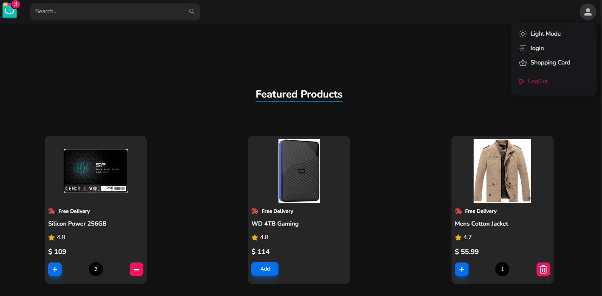
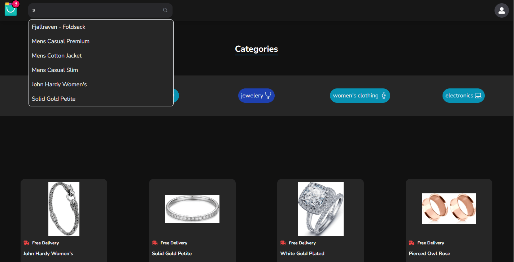
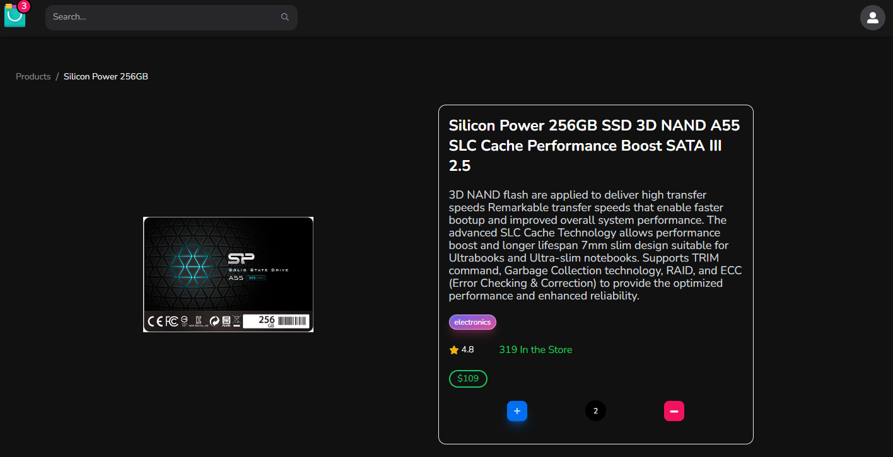
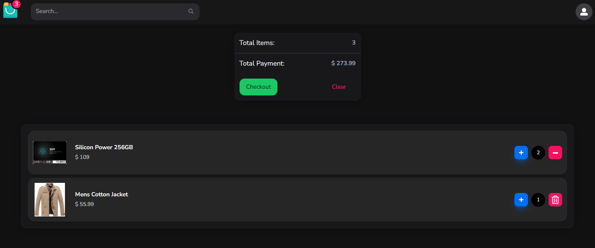

# React-Ecommerce-Shop

React JS E-commerce web app developed by Tailwind, next UI, Redux-Toolkit, RTK Query and more...













## Features

- **Product Catalog:** Explore our wide range of products conveniently organized into categories for easy browsing.
- **Product Details:** View detailed information about each product, including descriptions, images, and pricing.
- **Shopping Cart:** Add products to your cart and manage quantities before proceeding to checkout.
- **Persistent Storage**: Data is saved locally using localStorage, ensuring persistence across sessions.
- **Dark Mode**: dark mode & light mode support.
- **Responsive Design:** Enjoy a seamless shopping experience across various devices, including desktops, tablets, and mobile phones.
- **State Management**: Redux Toolkit is used for efficient state management.
- **Routing**: Built with react-router-dom for seamless navigation between different views.
- **User Notifications**: Utilizes react-toastify for displaying user-friendly notifications.
- **Styling**: Styled-components, Tailwindcss & NextUI is used to enhance UI aesthetics.

## Dependencies

- [React.js](https://reactjs.org/)
- [Redux Toolkit](https://redux-toolkit.js.org/)
- [tailwindcss](https://tailwindcss.com/)
- [next-UI](https://nextui.org/)
- [react-router-dom](https://reactrouter.com/web/guides/quick-start)
- [react-toastify](https://fkhadra.github.io/react-toastify/introduction)
- [styled-components](https://styled-components.com/)
- [swiper](https://swiperjs.com/)
- [react-icons](https://react-icons.github.io/react-icons/)

## Contributing

Contributions are welcome! If you'd like to contribute to this project, please feel free.

## License

This project is licensed under the [MIT License](LICENSE).

## Contact

For any inquiries or feedback, feel free to reach out to [parhamab17@gmail.com](parhamab17@gmail.com).

## Installation

To get started, simply clone the repository and install the dependencies:

```bash
git clone https://github.com/your-username/React-Ecommerce-Shop.git
cd React-Ecommerce-Shop
npm install
```
